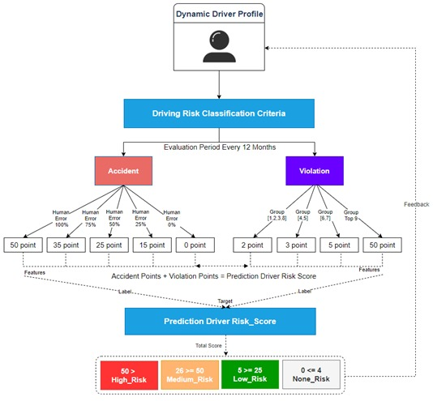
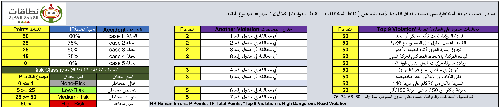
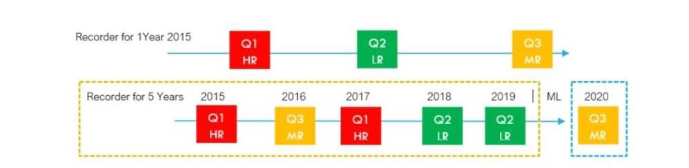
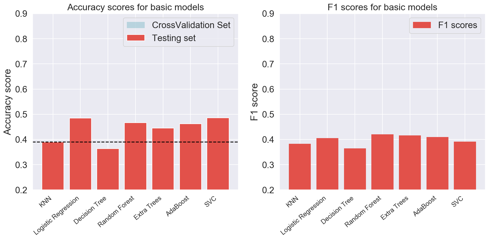
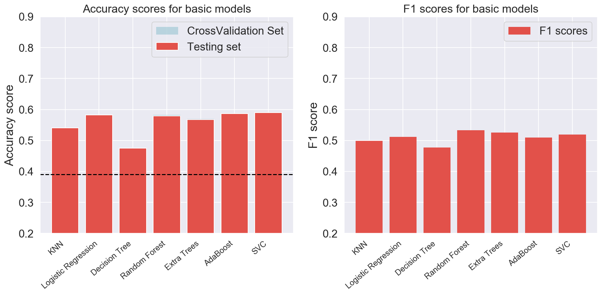
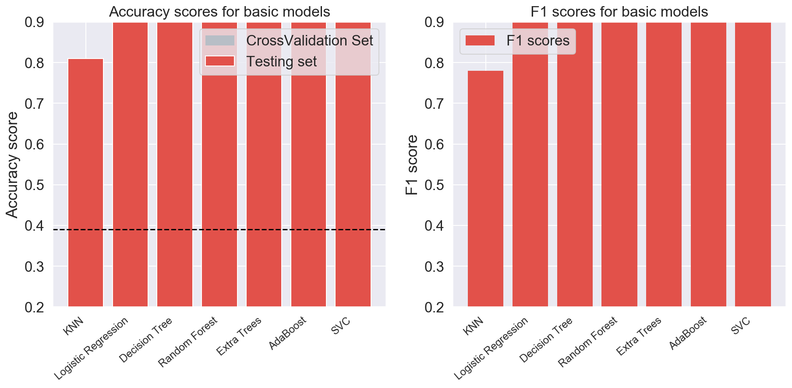

# Machine Learning Model for Identifying Personal Driver Behaviors Using Traffic Violation and Accident History Data

## Problem Statement
We are trying to predict drivers risk score in 2016 based on the violations and accident history data from 2011-2015

## Executive Summary
The dataset was generated and the count and points were randomly assigned to each driver, so there was no significant natural trends to learn from and train on to produce predictions that are highly accurate. Real datasets are needed to build accurate machine learning models that can predict drivers risk score. 

### Risk Criteria

### Contents:
- [Datasets Description](#Datasets_Description)
- [Data Import & Cleaning](#Data_Import_and_Cleaning)
	-    Monthly Method ( Dividing the year to 12 months)
	-    Part of year method ( dividing the year to 3 parts)
  
  	-   Yearly method (getting the points for the full year without dividing it)
- [Exploratory Data Analysis](#Exploratory_Data_Analysis)
    - [Data Visualization](#Visualize_the_data)
    - [Descriptive and Inferential Statistics](#Descriptive_and_Inferential_Statistics)
- [Preprocessing and Modeling](#Preprocessing_and_Modeling)
- [Conclusions and Recommendations](#Conclusions_and_Recommendations)

## Datasets Description
Four datasets about drivers, vehicle, violations, and accidents

- Driver dataframe shape: (49987, 5)
- Vehicle dataframe shape: (49987, 8)
- Violation dataframe shape: (1018634, 27)
- Accident dataframe shape: (587995, 46)

### List of abbreviations

| Abbreviation     | Meaning |
|------------------|------|
| POY| Part of Year|

## Conclusions and Recommendations
For the monthly dataset, the model with highest predictive score was Logistic Regression Model with an accuracy of 0.47 with the 5-fold cross validation compared to its baseline accuracy of 0.39.

For the part of year dataset, the model with highest predictive score was Ada Boost Model with an accuracy of 0.585 with the 5-fold cross validation compared to its baseline accuracy of 0.515.

For the yearly dataset, All the models had very high accuracy but very bad score for the medium risk class, as the 4 classes were not balanced with 78.9% of the dataset were classified as high risk.

The dataset was generated and the count and points were randomly assigned to each driver, so there was no significant natural trends to learn from and train on to produce predictions that are highly accurate.
